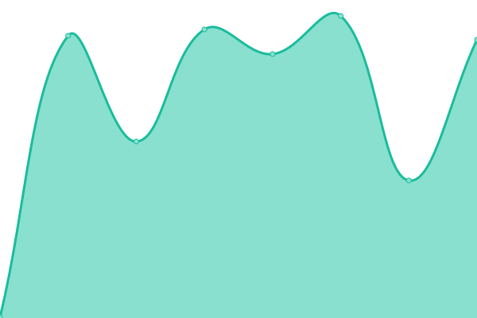
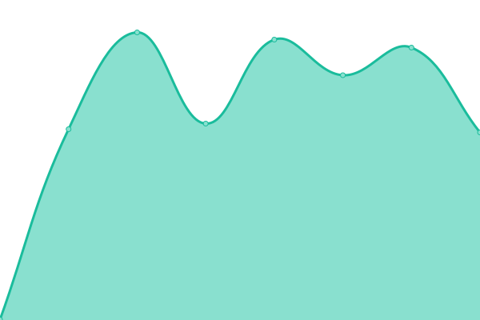

# [📈 Live Status](https://cfsausgit.github.io/upptime): <!--live status--> **🟧 Partial outage**

This repository contains the open-source uptime monitor and status page for [cfsausgit](https://cfsausgit.github.io/upptime), powered by [Upptime](https://github.com/upptime/upptime).

With [Upptime](https://upptime.js.org), you can get your own unlimited and free uptime monitor and status page, powered entirely by a GitHub repository. We use [Issues](https://github.com/cfsausgit/upptime/issues) as incident reports, [Actions](https://github.com/cfsausgit/upptime/actions) as uptime monitors, and [Pages](https://cfsausgit.github.io/upptime) for the status page.

<!--start: status pages-->
<!-- This summary is generated by Upptime (https://github.com/upptime/upptime) -->
<!-- Do not edit this manually, your changes will be overwritten -->
<!-- prettier-ignore -->
| URL | Status | History | Response Time | Uptime |
| --- | ------ | ------- | ------------- | ------ |
|  [CFS Website](https://www.cfs-australasia.com) | 🟥 Down | [cfs-website.yml](https://github.com/cfsausgit/upptime/commits/HEAD/history/cfs-website.yml) | 

 129ms
     
 | 

<a href="https://status.cfs-australasia.com/history/cfs-website">0.00%</a>
    

|  Front End (API Server) | 🟩 Up | [front-end-api-server.yml](https://github.com/cfsausgit/upptime/commits/HEAD/history/front-end-api-server.yml) | 

 635ms
     
 | 

<a href="https://status.cfs-australasia.com/history/front-end-api-server">100.00%</a>
    

|  URL Shortener | 🟩 Up | [url-shortener.yml](https://github.com/cfsausgit/upptime/commits/HEAD/history/url-shortener.yml) | 

 568ms
     
 | 

<a href="https://status.cfs-australasia.com/history/url-shortener">100.00%</a>
    

|  Snap Webhost | 🟩 Up | [snap-webhost.yml](https://github.com/cfsausgit/upptime/commits/HEAD/history/snap-webhost.yml) | 

 732ms
     
 | 

<a href="https://status.cfs-australasia.com/history/snap-webhost">100.00%</a>
    

|  Survey To Go | 🟩 Up | [survey-to-go.yml](https://github.com/cfsausgit/upptime/commits/HEAD/history/survey-to-go.yml) | 

 338ms
     
 | 

<a href="https://status.cfs-australasia.com/history/survey-to-go">100.00%</a>
    

|  Grafana | 🟥 Down | [grafana.yml](https://github.com/cfsausgit/upptime/commits/HEAD/history/grafana.yml) | 

 578ms
     
 | 

<a href="https://status.cfs-australasia.com/history/grafana">0.00%</a>
    

|  Argo | 🟥 Down | [argo.yml](https://github.com/cfsausgit/upptime/commits/HEAD/history/argo.yml) | 

 0ms
     
 | 

<a href="https://status.cfs-australasia.com/history/argo">0.00%</a>
    

<!--end: status pages-->

[**Visit our status website →**](https://cfsausgit.github.io/upptime)

## 📄 License

- Powered by: [Upptime](https://github.com/upptime/upptime)
- Code: [MIT](./LICENSE) © [cfsausgit](https://cfsausgit.github.io/upptime)
- Data in the `./history` directory: [Open Database License](https://opendatacommons.org/licenses/odbl/1-0/)
